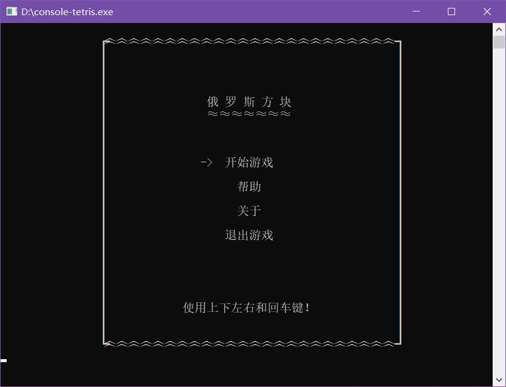
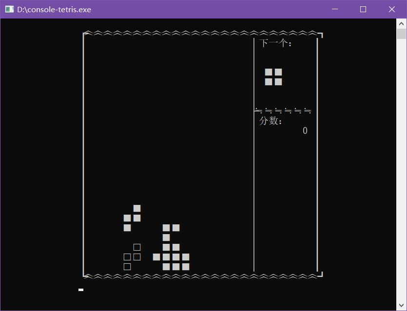
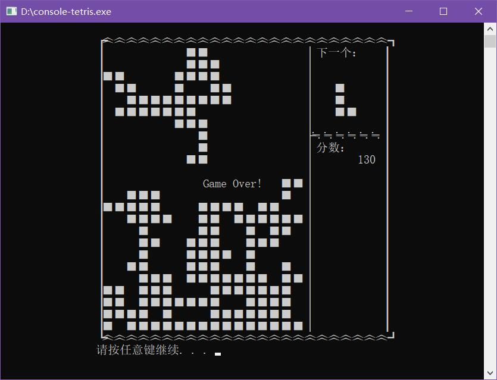

# console-tetris
命令行俄罗斯方块
## 编译
* 安装cmake 3.0以上
* 安装mingw-w64 http://www.mingw-w64.org
* 在cmd中执行如下命令
```bash
cmake -DCMAKE_BUILD_TYPE=Release  -G "MinGW Makefiles" -S . -B cmake-build-release
cmake  --build cmake-build-release
```
## 效果图




## 联系方式
shpodg@gmail.com
